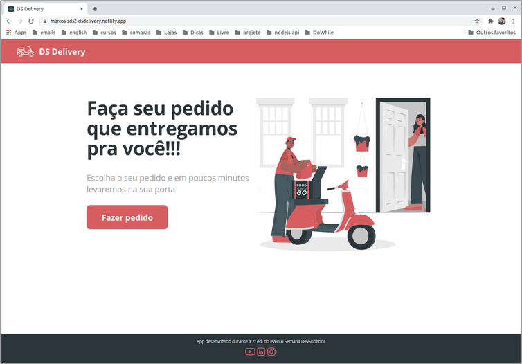
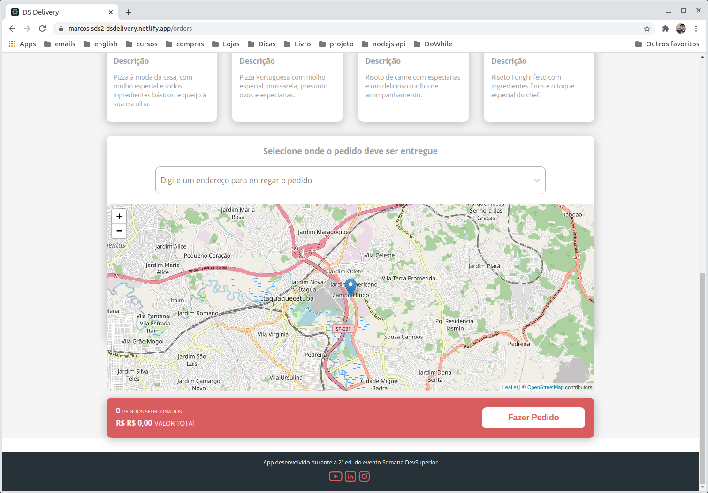
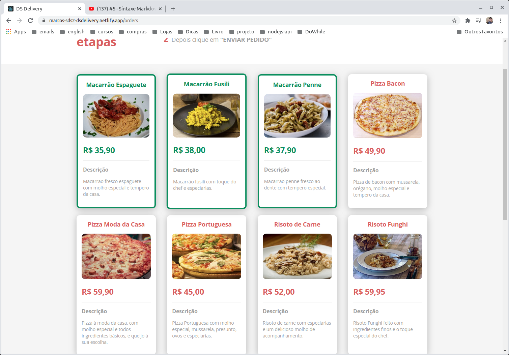

# DSDelivery

  Este é um projeto desenvolvido durante a Semana DevSuperior, um evento disponibilizado pelo canal [DevSuperior](https://www.youtube.com/c/DevSuperior) que tem o intuito de demonstrar como é possivel desenvolvar aplicações full-stacks com as tecnologias **Java + Spring Boot + ReactJS**

# Sumario

+ [Tecnologias](#Tecnologias)
+ [Links](#Links)
+ [Back-end](#Back-end)
+ [Front-end](#Front-end)

## Tecnologias
   

## Links

+ [link para o front-end](https://marcos-sds2-dsdelivery.netlify.app)
+ [link para o back-end](https://marcos-sds2-delivery.herokuapp.com/products)

## Back-end

O Back end foi construido utilizando java com o framework spring boot com o banco de dados postgresql

**Bibliotecas utilizadas**
+ Spring data jpa
+ Spring security
+ Spring web
+ Postgresql driver
+ h2 database

Na parte do backend foi ensinado a como criar e utilizar arquivos de configurações do spring boot chamados de properties,
a como organizar pastas de uma rest api em java com o spring web, foi utilizado tambem o h2 um database runtime para testar a api em tempo de desenvolvimento, depois migramos para o properties de dev para conectar a api a um database local e depois no ultimo profile foi configurado no heroku uma instancia do postgres para ser utilizado na aplicação ja em produção   

**OBS**
como eu não tinha o postgres instalado na maquina decidi usar uma instancia do postgres no docker, abaixo segue os comando que utilizei para criar o container

+ criar o container 

~~~Bash
  docker run --name postgres-sds2 -p 80:80 -e POSTGRES_DB=dsdelivery -e POSTGRES_USER=postgres -e POSTGRES_PASSWORD=postgres -d postgres
~~~

+ entrar no postgres para criar as tabelas ou scripts  
~~~Bash
  docker exec --it postgres-sds2 /bin/bash
~~~

+ entrar no database
~~~Bash
  psql -U postgres postgres-sds2
~~~

## Front-end

No front-end foi usado a biblioteca ReactJs com typescript para construir a interface com a ajuda de outras bibliotecas, nessa parte da aula foi abordada a sintaxe do ReactJS e alguns conceitos como o de props, useState, useEffect

**Bibliotecas utilizadas**
+ ReactJS
+ react-route-dom
+ axios
+ react-leaflet
+ react-select
+ react-toastify

### **Imagens**

**Home**

**lista de produtos**

**Mapa para marcar sua localização**

**item selecionado**

